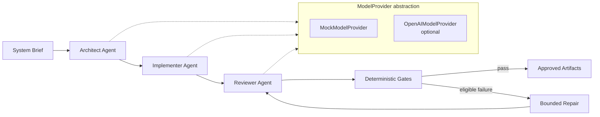

# Cognitive Agent Syndicate

[](https://www.python.org/downloads/)
[](LICENSE)

A contract-driven multi-agent software-delivery pipeline with typed outputs, deterministic validation, bounded repair, optional OpenAI integration, and a reproducible benchmark harness.

**Architect → Implementer → Reviewer → Deterministic Gates → Optional Repair**

## Live benchmark snapshot

In this exploratory six-task live run, the repair-enabled contract mode succeeded on **5 of 6** trials, compared with **1 of 6** for each other mode.

**This is an exploratory benchmark with one repetition per task/mode, not a statistically significant evaluation.**

| Mode | Successful trials | Success rate |
| --- | ---: | ---: |
| Single-agent baseline | 1/6 | 16.67% |
| Contract pipeline, no repair | 1/6 | 16.67% |
| Contract pipeline, bounded repair | 5/6 | 83.33% |

Run context (sanitized evidence from [`benchmarks/results/live-suite-r1/`](benchmarks/results/live-suite-r1/)):

- 6 fixed software-delivery tasks
- 1 repetition per task/mode
- 18 total live trials — 18/18 completed, 0 provider/infrastructure failures
- 56 observed provider calls; 208,099 observed tokens
- 4 repair attempts; 3 repair successes
- Generated code was **not executed**
- Same model used for generation and review (`gpt-5.6-luna`)
- Pricing not configured

Full methodology, caveats, and per-trial outcomes: [`benchmarks/results/live-suite-r1/README.md`](benchmarks/results/live-suite-r1/README.md)

## Why this project exists

**Engineering question:** Does forcing agents to communicate through explicit contracts and deterministic gates improve software-delivery reliability compared with a single generation step?

Three modes are compared on identical tasks and acceptance criteria:

1. **`single_agent`** — One structured generation call produces architecture and artifacts, followed by review and deterministic gates.
2. **`contract_no_repair`** — Architect → implementer → reviewer pipeline with `max_repair_attempts=0`.
3. **`contract_with_repair`** — Same contract pipeline with at most one bounded repair attempt when eligible.

## Architecture



Each agent stage calls through a shared **`ModelProvider`** protocol. The default **`MockModelProvider`** returns deterministic structured outputs for offline development and CI. An optional **`OpenAIModelProvider`** uses the OpenAI Responses API with structured outputs when explicitly enabled.

## Core engineering features

### Typed contracts

Inter-agent handoffs are Pydantic models, not free-form chat:

- **`SystemBrief`** — task title, description, acceptance criteria
- **`ArchitectureSpec`** — components, endpoints, data model
- **`ArtifactBundle`** — generated file paths and contents
- **`ReviewReport`** — structured reviewer findings and status
- Typed benchmark results — trial outcomes, gate results, usage metrics

### Provider abstraction

- **`ModelProvider`** protocol with async structured generation
- Deterministic **`MockModelProvider`** for reproducible offline runs
- Optional **`OpenAIModelProvider`** (OpenAI Responses API + structured outputs)
- Base installation has **no OpenAI dependency**; install `[openai]` only when needed

### Deterministic validation

After review, a fixed gate suite evaluates outputs without executing generated code:

- Safe relative paths and permitted-prefix checks
- Required project files (e.g. `pyproject.toml`, tests)
- Python AST/syntax validation
- Architecture/data-model consistency
- File/directory hierarchy collision checks
- Limited forbidden-content/static-policy checks
- Acceptance-criterion representation in review findings
- Reviewer status consistency with findings

**Generated code is parsed and statically inspected but never executed.**

### Bounded repair

When a gate failure is repairable and reviewer policy allows it:

- At most **one** repair attempt per trial
- Repair re-enters the reviewer and gate pass
- Complete attempt history is recorded
- No unbounded agent loops

### Safe persistence

Approved artifacts are written through staging:

- Files land in a unique staging directory first
- Atomic rename to the final run directory on success
- Existing files are never overwritten
- Failed runs do not persist as approved artifacts

## Benchmark methodology

**Dataset:** `software_delivery` v1 — six tasks:

| Task ID | Domain |
| --- | --- |
| `task-url-shortener` | URL shortening API |
| `task-support-ticket` | Support-ticket classification |
| `task-document-ingestion` | Document ingestion |
| `task-feature-flag` | Feature flags |
| `task-inventory-reservation` | Inventory reservation |
| `task-incident-summary` | Incident summary |

**Modes:** `single_agent`, `contract_no_repair`, `contract_with_repair`

**Fairness controls:**

- Same tasks, acceptance criteria, and required files
- Same deterministic gates and reviewer policy
- Same generation and reviewer model in the published live run
- Same temperature/config where applicable

**Metrics captured per trial:**

- Success, reviewer outcome, individual gate outcomes
- Repair attempt and success flags
- Exact provider call counts, token usage, provider latency
- Wall-clock duration
- Optional observed-token cost estimation when pricing is configured

See [`docs/benchmarking.md`](docs/benchmarking.md) for trial status semantics, token accounting, and reporting details.

## One-command live validation

```bash
python -m cognitive_agent_syndicate validate-live \
  --task-ids task-url-shortener \
  --repetitions 3 \
  --model gpt-5.6-luna \
  --confirm-live
```

This command:

1. Runs preflight checks (clean tree, dependencies, opt-in confirmation)
2. Securely prompts for the API key if not already in the environment
3. Executes a one-call structured-output smoke test
4. Prints the benchmark plan
5. Reports live progress during execution
6. Runs the benchmark and restores credentials automatically
7. Persists outputs under `benchmark_results/` and writes `live-validation.json`
8. Prints a final handoff summary

**API usage may incur cost.** Keys are read from environment configuration only — never pass API keys as CLI arguments. See [`docs/live-provider.md`](docs/live-provider.md).

## Quick start

### Base install (offline-first)

```bash
python -m venv .venv
source .venv/bin/activate
python -m pip install -e ".[dev]"
```

Run the offline test suite:

```bash
pytest
```

Run the mock pipeline on an example brief:

```bash
python -m cognitive_agent_syndicate run examples/briefs/url_shortener.json --provider mock
```

Preview a benchmark plan (no provider calls):

```bash
python -m cognitive_agent_syndicate benchmark plan \
  --dataset benchmarks/datasets/software_delivery_v1.json \
  --modes single_agent,contract_no_repair,contract_with_repair \
  --repetitions 1 \
  --provider mock
```

Run a mock benchmark (validates the harness; does not measure real model quality):

```bash
python -m cognitive_agent_syndicate benchmark run \
  --dataset benchmarks/datasets/software_delivery_v1.json \
  --task-ids task-url-shortener \
  --modes single_agent,contract_no_repair,contract_with_repair \
  --repetitions 1 \
  --provider mock
```

The base project works without OpenAI installed.

### Optional OpenAI provider

```bash
python -m pip install -e ".[openai]"
```

Live usage requires explicit opt-in (`--confirm-live` or `validate-live --confirm-live`). Details: [`docs/benchmarking.md`](docs/benchmarking.md), [`docs/live-provider.md`](docs/live-provider.md).

## Project structure

Representative structure:

```
src/cognitive_agent_syndicate/
├── agents/              # Architect, implementer, reviewer agents
├── benchmarking/        # Dataset loading, runner, metrics, reporting
├── live_validation/   # Preflight, smoke test, credential handling
├── orchestration/       # Pipeline state machine and coordination
├── providers/           # ModelProvider, mock, optional OpenAI
├── validation/          # Deterministic gates and repair eligibility
├── reporting/           # Artifact persistence and run reports
├── schemas.py           # Pydantic contracts
├── cli.py               # Typer CLI entry point
└── validate_live_cli.py # Live validation command

benchmarks/
├── datasets/            # software_delivery_v1.json
├── pricing/             # Optional cost-estimation config
└── results/live-suite-r1/  # Sanitized live evidence snapshot

tests/
docs/
examples/briefs/
```

## Design boundaries

- Generated code is **never executed** during pipeline or benchmark runs
- Static policy checks are **not** a security scanner
- No sandbox or isolation guarantees are claimed
- Repair is bounded to one attempt — no unbounded loops
- Live API usage is opt-in and requires explicit confirmation
- API keys are never accepted as CLI arguments
- Same-model reviewer (generation and review on the same model) can reduce independence
- Published benchmark results are exploratory, not statistically significant

## Testing and quality

| Check | Status |
| --- | --- |
| Offline tests | **449 passing** (`pytest`; 2 live tests excluded by default) |
| Coverage | **~94%** on `src/cognitive_agent_syndicate` |
| Lint | Ruff (`ruff check .`) |
| Format | Ruff (`ruff format --check .`) |
| Types | mypy strict on `src/` |
| CI | GitHub Actions on Python 3.11 |

```bash
ruff check .
ruff format --check .
mypy src
pytest --cov=src/cognitive_agent_syndicate --cov-report=term-missing
```

## Benchmark evidence

Sanitized live evidence (no prompts, generated code, or raw SDK responses):

| File | Description |
| --- | --- |
| [`benchmarks/results/live-suite-r1/README.md`](benchmarks/results/live-suite-r1/README.md) | Human-readable summary and caveats |
| [`benchmarks/results/live-suite-r1/summary.json`](benchmarks/results/live-suite-r1/summary.json) | Aggregate metrics (schema v1.0) |
| [`benchmarks/results/live-suite-r1/results.csv`](benchmarks/results/live-suite-r1/results.csv) | Per-trial outcomes |
| [`benchmarks/results/live-suite-r1/methodology.json`](benchmarks/results/live-suite-r1/methodology.json) | Run design and limitations |

## Tech stack

Dependencies declared in `pyproject.toml`:

- Python ≥ 3.11
- Pydantic / pydantic-settings
- Typer / Rich
- OpenAI Python SDK (optional `[openai]` extra)
- OpenAI Responses API + Structured Outputs (live provider)
- pytest / pytest-asyncio / pytest-cov
- Ruff
- mypy
- GitHub Actions

## Engineering decisions

Design choices that shape evaluation and reliability:

- **Contracts over free-form handoffs** — Every stage emits a validated schema, making failures inspectable and gate rules deterministic.
- **Deterministic gates over LLM-only evaluation** — Static checks catch structural issues the reviewer might miss; gates run the same way in mock and live modes.
- **Bounded repair over unlimited loops** — One repair attempt caps cost and prevents runaway agent cycles.
- **Provider abstraction for offline determinism** — Mock and live providers share the same pipeline code path.
- **Exact call/token accounting** — Every provider invocation is instrumented for benchmark comparison.
- **Atomic result persistence** — Staging + rename prevents partial or corrupted artifact directories.
- **Explicit live opt-in and secret handling** — API keys via environment or secure prompt only; credentials restored after live runs.
- **Single-agent baseline** — Contract modes are measured against a direct-generation alternative on identical tasks.

## Limitations

- Small benchmark dataset (six tasks)
- One repetition per task/mode in the published evidence snapshot — no variance estimate
- Same model for generation and review in the live run
- Static analysis only; generated code is not executed or tested at runtime
- No statistical-significance claim; results may not generalize
- Live outcomes can vary with model, provider, and prompt behavior
- Benchmark trials run sequentially — no concurrency in current execution

## License

MIT — see [LICENSE](LICENSE).
